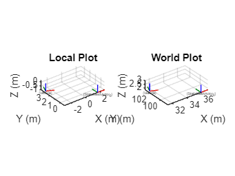
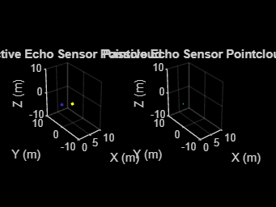
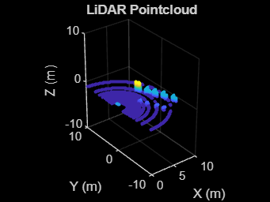
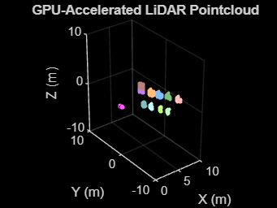
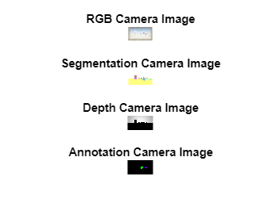
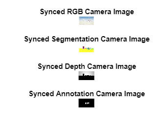

# Cosys\-AirSim Matlab Client

This a client implementation of the RPC API for Matlab for the Cosys\-AirSim simulation framework. A main class AirSimClient is available which implements all API calls.


Do note that at this point not all functions have been tested and most function documentation was auto\-generated. This is still a WIP client.

## Dependencies
-  MATLAB 2024a or higher with the associated supported Python version, 3.7 or higher with the Cosys\-AirSim python module.  
-  Computer Vision, Aerospace, Signal Processing Toolboxes 

You can install the Cosys\-AirSim Python client from pip (not from matlab console but with terminal/powershell/bash):

```matlab
pip install cosysairsim
```
## Usage
#### **Configure Python for MATLAB**

First you need to correctly link your installed Python installation to MATLAB, as by default this isn't always the latest version of Python 3 you installed. You can verify which Python is linked by running:

```matlab
pe = pyenv;
pe.Version
```

If this is not a version that you which to use you can alter this manually. Do note that you need to do this everytime before using the client! Once Python is loaded in matlab, you need to restart MATLAB first before changing it. Therefore, running the commands above will likely mean requiring a restart of MATLAB.


For Windows you can run for example:

```matlab
pyenv('Version','your.version') 
```

With *'your.version'* indicating the *'major.minor'* version number of you Python release, for example *'3.6'.*


On linux you need to refer to the path of your Python 3 installation,, for example:

```matlab
pyenv('Version',"/usr/bin/python3") 
```

You can also link to specific Python versions by altering the path.


Some more information can be found [here](<https://nl.mathworks.com/help/matlab/matlab_external/install-supported-python-implementation.html#buialof-40>).

#### **Initial setup**

When starting with this wrapper, first try to make a connection to the Cosys\-AirSim simulation. 

```matlab
vehicle_name = "airsimvehicle";
airSimClient = AirSimClient(IsDrone=false, IP="127.0.0.1", port=41451);
```

Now the client object can be used to run API methods from. All functions have some help text written for more information on them. 

## Example

This example works well with the default [example settings](https://github.com/Cosys-Lab/Cosys-AirSim/blob/main/docs/settings_example.json) found in the docs folder op the Cosys\-AirSim repository. 


This example will:

-  Connect to AirSim 
-  Get/set vehicle pose 
-  Get instance segmentation groundtruth table 
-  Get object pose(s) 
-  Get sensor data (imu, echo (active/passive), (gpu)LiDAR, camera (info, rgb, depth, segmentation, annotation)) 

Do note that the AirSim matlab client has almost all API functions available but not all are listed in this test script. For a full list see the source code fo the AirSimClient class. 


Do note the test script requires next to the toolboxes listed above in the Prerequisites the following Matlab toolboxes:

-  Lidar Toolbox 
-  Navigation Toolbox 
-  Robotics System Toolbox 
-  ROS Toolbox 
-  UAV Toolbox 
#### Setup connection
```matlab

%Define client
vehicle_name = "airsimvehicle";
airSimClient = AirSimClient(IsDrone=false, IP="127.0.0.1", port=41451);

```
#### Groundtruth labels
```matlab
% Get groundtruth look-up-table of all objects and their instance
% segmentation colors for the cameras and GPU LiDAR
groundtruthLUT = airSimClient.getInstanceSegmentationLUT();

```
#### Get some poses
```matlab
% All poses are right handed coordinate system X Y Z and
% orientations are defined as quaternions W X Y Z.

% Get poses of all objects in the scene, this takes a while for large
% scene so it is in comment by default
poses = airSimClient.getAllObjectPoses(false, false);

% Get vehicle pose
vehiclePoseLocal = airSimClient.getVehiclePose(vehicle_name);
vehiclePoseWorld = airSimClient.getObjectPose(vehicle_name, false);

% Choose the object to get the pose from (this one is in the Blocks env)
chosenObject = "Cylinder3";

% Get its pose
objectPoseLocal = airSimClient.getObjectPose(chosenObject, true);
objectPoseWorld = airSimClient.getObjectPose(chosenObject, false);

figure;
subplot(1, 2, 1);
plotTransforms([vehiclePoseLocal.position; objectPoseLocal.position], [vehiclePoseLocal.orientation; objectPoseLocal.orientation], FrameLabel=["Vehicle"; chosenObject], AxisLabels="on")
axis equal;
grid on;
xlabel("X (m)")
ylabel("Y (m)")
zlabel("Z (m)")
title("Local Plot")

subplot(1, 2, 2);
plotTransforms([vehiclePoseWorld.position; objectPoseWorld.position], [vehiclePoseWorld.orientation; objectPoseWorld.orientation], FrameLabel=["Vehicle"; chosenObject], AxisLabels="on")

axis equal;
grid on;
xlabel("X (m)")
ylabel("Y (m)")
zlabel("Z (m)")
title("World Plot")
drawnow

% Set vehicle pose
airSimClient.setVehiclePose(airSimClient.getVehiclePose(vehicle_name).position + [1 1 0], airSimClient.getVehiclePose(vehicle_name).orientation, true, vehicle_name)
```




#### IMU sensor Data
```matlab

imuSensorName = "imu";
[imuData, imuTimestamp] = airSimClient.getIMUData(imuSensorName, vehicle_name)

```
#### Echo sensor data
```matlab
% Example plots passive echo pointcloud
% and its reflection directions as 3D quivers

echoSensorName = "echo";
enablePassive = true;
[activePointCloud, activeData, passivePointCloud, passiveData , echoTimestamp, echoSensorPose] = airSimClient.getEchoData(echoSensorName, enablePassive, vehicle_name);

figure;
subplot(1, 2, 1);
if ~isempty(activePointCloud)
    pcshow(activePointCloud, color="X", MarkerSize=50);
else
    pcshow(pointCloud([0, 0, 0]));
end
title('Active Echo Sensor Pointcloud')
xlabel("X (m)")
ylabel("Y (m)")
zlabel("Z (m)")
xlim([0 10])
ylim([-10 10])
zlim([-10 10])

subplot(1, 2, 2);
if ~isempty(passivePointCloud)
    pcshow(passivePointCloud, color="X", MarkerSize=50);
    hold on;
    quiver3(passivePointCloud.Location(:, 1), passivePointCloud.Location(:, 2), passivePointCloud.Location(:, 3),...
        passivePointCloud.Normal(:, 1), passivePointCloud.Normal(:, 2), passivePointCloud.Normal(:, 3), 2);
    hold off
else
    pcshow(pointCloud([0, 0, 0]));
end
title('Passive Echo Sensor Pointcloud')
xlabel("X (m)")
ylabel("Y (m)")
zlabel("Z (m)")
xlim([0 10])
ylim([-10 10])
zlim([-10 10])
drawnow
```




#### LiDAR sensor data
```matlab
% Example plots lidar pointcloud and getting the groundtruth labels
```



```matlab

lidarSensorName = "lidar";
enableLabels = true;
[lidarPointCloud, lidarLabels, LidarTimestamp, LidarSensorPose] = airSimClient.getLidarData(lidarSensorName, enableLabels, vehicle_name);

figure;
if ~isempty(lidarPointCloud)
    pcshow(lidarPointCloud, MarkerSize=50);
else
    pcshow(pointCloud([0, 0, 0]));
end
title('LiDAR Pointcloud')
xlabel("X (m)")
ylabel("Y (m)")
zlabel("Z (m)")
xlim([0 10])
ylim([-10 10])
zlim([-10 10])
drawnow

```
#### GPU LiDAR sensor data
```matlab
% Example plots GPU lidar pointcloud with its RGB segmentation colors

gpuLidarSensorName = "gpulidar";
enableLabels = true;
[gpuLidarPointCloud, gpuLidarTimestamp, gpuLidarSensorPose] = airSimClient.getGPULidarData(gpuLidarSensorName, vehicle_name);

figure;
if ~isempty(gpuLidarPointCloud)
    pcshow(gpuLidarPointCloud, MarkerSize=50);
else
    pcshow(pointCloud([0, 0, 0]));
end
title('GPU-Accelerated LiDAR Pointcloud')
xlabel("X (m)")
ylabel("Y (m)")
zlabel("Z (m)")
xlim([0 10])
ylim([-10 10])
zlim([-10 10])
drawnow
```




#### Cameras
```matlab

%% Get camera info
cameraSensorName = "frontcamera";
[intrinsics, cameraSensorPose] = airSimClient.getCameraInfo(cameraSensorName, vehicle_name);

%% Get single camera images
% Get images sequentially 

cameraSensorName = "front_center";
[rgbImage, rgbCameraIimestamp] = airSimClient.getCameraImage(cameraSensorName, AirSimCameraTypes.Scene, vehicle_name);
[segmentationImage, segmentationCameraIimestamp] = airSimClient.getCameraImage(cameraSensorName, AirSimCameraTypes.Segmentation,vehicle_name);
[depthImage, depthCameraIimestamp] = airSimClient.getCameraImage(cameraSensorName, AirSimCameraTypes.DepthPlanar,vehicle_name);
figure;
subplot(3, 1, 1);
imshow(rgbImage)
title("RGB Camera Image")
subplot(3, 1, 2);
imshow(segmentationImage)
title("Segmentation Camera Image")
subplot(3, 1, 3);
imshow(depthImage ./ max(max(depthImage)).* 255, gray)
title("Depth Camera Image")
drawnow

```



```matlab

%% Get synced camera images
% By combining the image requests they will be synced 
% and taken in the same frame

cameraSensorName = "front_center";
[images, cameraIimestamp] = airSimClient.getCameraImages(cameraSensorName, ...
                                                         [AirSimCameraTypes.Scene, AirSimCameraTypes.Segmentation, AirSimCameraTypes.DepthPlanar], ...
                                                         vehicle_name, ["", "", ""]);
figure;
subplot(3, 1, 1);
imshow(images{1})
title("Synced RGB Camera Image")
subplot(3, 1, 2);
imshow(images{2})
title("Synced Segmentation Camera Image")
subplot(3, 1, 3);
imshow(images{3} ./ max(max(images{3})).* 255, gray)
title("Synced Depth Camera Image")
drawnow
```


## Example Two Drones

This example works well with the settings file as in the comments below:

```
{
    "SeeDocsAt": "https://cosys-lab.github.io/settings/",
    "SettingsVersion": 2,
    "ClockSpeed": 1,
    "LocalHostIp": "127.0.0.1",
    "ApiServerPort": 41451,
    "RpcEnabled": true,
    "SimMode": "Multirotor",
    "Vehicles": {
        "Drone1": {
            "VehicleType": "SimpleFlight",
            "AllowAPIAlways": true,
            "X": 0,
            "Y": 0,
            "Z": 0,
            "Yaw": 0
        },
        "Drone2": {
            "VehicleType": "SimpleFlight",
            "AllowAPIAlways": true,
            "X": 5,
            "Y": 0,
            "Z": 0,
            "Yaw": 0
        }
    }
}
```
```matlab
airSimClient = AirSimClient(IsDrone=true, IP="127.0.0.1", port=41451);

airSimClient.setEnableApiControl("Drone1");
airSimClient.setEnableApiControl("Drone2");

airSimClient.setEnableDroneArm("Drone1");
airSimClient.setEnableDroneArm("Drone2");

airSimClient.takeoffAsync("Drone1", 20, true);
airSimClient.takeoffAsync("Drone2", 20, false);

airSimClient.moveToPositionAsync(10, 10, -5, 5, 3e+38, AirSimDrivetrainTypes.MaxDegreeOfFreedom, true, 0, -1, 1, "Drone1", true);
airSimClient.moveToPositionAsync(10, 14, -5, 5, 3e+38, AirSimDrivetrainTypes.MaxDegreeOfFreedom, true, 0, -1, 1, "Drone2", true); 

airSimClient.landAsync("Drone1", 60, true);
airSimClient.landAsync("Drone2", 60, false);

airSimClient.setDisableDroneArm("Drone1");
airSimClient.setDisableDroneArm("Drone2");

airSimClient.setDisableApiControl("Drone1");
airSimClient.setDisableApiControl("Drone2");
```
