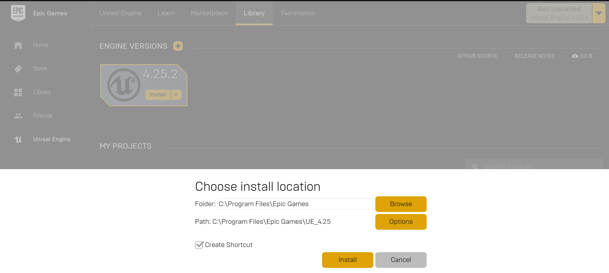

# Build Cosys-AirSim on Windows from Source

## Install Unreal Engine
1. [Download](https://www.unrealengine.com/download) the Epic Games Launcher. While the Unreal Engine is open source and free to download, registration is still required.
2. Run the Epic Games Launcher, open the `Unreal Engine` tab on the left pane.
Click on the `Install` button on the top right, which should show the option to download **Unreal Engine 5.2.1**. Chose the install location to suit your needs, as shown in the images below. If you have multiple versions of Unreal installed then **make sure the version you are using is set to `current`** by clicking down arrow next to the Launch button for the version.



## Build Cosys-AirSim
* Install Visual Studio 2022. Make sure to select Desktop Development with C++ and Windows 10/11 SDK **10.0.X (choose latest)** and select the latest .NET Framework SDK under the 'Individual Components' tab while installing VS 2022. More info [here](https://dev.epicgames.com/documentation/en-us/unreal-engine/setting-up-visual-studio-development-environment-for-cplusplus-projects-in-unreal-engine?application_version=5.2).
* Start `Developer Command Prompt for VS 2022`. 
* Clone the repo: `git clone https://github.com/Cosys-Lab/Cosys-AirSim.git`, and go the AirSim directory by `cd Cosys-AirSim`. 
* Run `build.cmd` from the command line. This will create ready to use plugin bits in the `Unreal\Plugins` folder that can be dropped into any Unreal project.

## Build Unreal Project

Finally, you will need an Unreal project that hosts the environment for your vehicles. Make sure to close and re-open the Unreal Engine and the Epic Games Launcher before building your first environment if you haven't done so already. After restarting the Epic Games Launcher it will ask you to associate project file extensions with Unreal Engine, click on 'fix now' to fix it. Cosys-AirSim comes with a built-in "Blocks Environment" which you can use, or you can create your own. Please see [setting up Unreal Environment](unreal_proj.md).

## Setup Remote Control (Multirotor only)

A remote control is required if you want to fly the drone manually. See the [remote control setup](remote_control.md) for more details.
Alternatively, you can use [APIs](apis.md) for programmatic control or use the so-called [Computer Vision mode](image_apis.md) to move around using the keyboard.

## How to Use Cosys-AirSim

Once Cosys-AirSim is set up by following above steps, for launching and building it through Visual Studio you can,
1. Navigate to folder `Unreal\Environments\Blocks` and run `update_from_git.bat`.
2. Double click on .sln file to load the Blocks project in `Unreal\Environments\Blocks` (or .sln file in your own [custom](unreal_custenv.md) Unreal project). If you don't see .sln file then you probably haven't completed steps in Build Unreal Project section above.
3. Select your Unreal project as Start Up project (for example, Blocks project) and make sure Build config is set to "Develop Editor" and x64.
4. After Unreal Editor loads, press Play button. 

!!! tip
    Go to 'Edit->Editor Preferences', in the 'Search' box type 'CPU' and ensure that the 'Use Less CPU when in Background' is unchecked.

You can install the Cosys-AirSim Python client from pip with `pip install cosysairsim`.
See [Using APIs](apis.md) and [settings.json](settings.md) for various options available.

Alternatively you can also simply open the Unreal Engine project by double clicking the _Blocks.uproject_ file.

# FAQ


#### I get an error `Il ‘P1’, version ‘X’, does not match ‘P2’, version ‘X’`
This is caused by having multiple MSVC toolset versions installed, where Unreal and the prebuilt AirLib/MavLinkCom libraries were compiled with different ones. The build script of Cosys-AirSim will use the latest MSVC toolset it can find, so you need to make Unreal do the same (or vice versa, see below).
Open or create a file called `BuildConfiguration.xml` in _C:\Users\USERNAME\AppData\Roaming\Unreal Engine\UnrealBuildTool_ and add the following:

```xml
<?xml version="1.0" encoding="utf-8" ?> 
<Configuration xmlns="https://www.unrealengine.com/BuildConfiguration">
<WindowsPlatform>
<CompilerVersion>Latest</CompilerVersion>
</WindowsPlatform>
</Configuration>
```

#### I get `error C4668: '__has_feature' is not defined as a preprocessor macro` (or "Detected compiler newer than Visual Studio 2022, please update min version checking...") when building with UE 5.2
This means Visual Studio has auto-updated to an MSVC toolset that is newer than what UE was built to support.

To fix it:
1. Open the Visual Studio Installer and, under "Individual components", install an older MSVC toolset that UE supports alongside your current one (multiple toolset versions can be installed side by side). Note the exact version number of the folder it installs, e.g. `14.38.33130`, under `C:\Program Files\Microsoft Visual Studio\2022\Community\VC\Tools\MSVC\`.
2. In `BuildConfiguration.xml` (see above), pin `CompilerVersion` to that exact installed version instead of `Latest`, e.g.:
```xml
<WindowsPlatform>
<CompilerVersion>14.38.33130</CompilerVersion>
</WindowsPlatform>
```
3. Since the prebuilt `AirLib`/`MavLinkCom`/rpclib libraries were likely compiled with the newer (too-new) toolset, rebuild them with the same pinned toolset to avoid the IL mismatch error above. Simply setting `VCToolsVersion` or running from a specific Developer Command Prompt is **not** enough by itself. `build.cmd` reads an optional `AIRSIM_VCTOOLSVERSION` environment variable and passes it through correctly to both. From **Developer Command Prompt for VS 202X**, run `clean.cmd` followed by:
```bat
set AIRSIM_VCTOOLSVERSION=14.38.33130
build.cmd
```

#### I get `error C100 : An internal error has occurred in the compiler` when running build.cmd
We have noticed this happening with VS version `15.9.0` and have checked-in a workaround in Cosys-AirSim code. If you have this VS version, please make sure to pull the latest Cosys-AirSim code.

#### I get error "'corecrt.h': No such file or directory" or "Windows SDK version 8.1 not found"
Very likely you don't have [Windows SDK](https://developercommunity.visualstudio.com/content/problem/3754/cant-compile-c-program-because-of-sdk-81cant-add-a.html) installed with Visual Studio. 

#### How do I use PX4 firmware with Cosys-AirSim?
By default, Cosys-AirSim uses its own built-in firmware called [simple_flight](simple_flight.md). There is no additional setup if you just want to go with it. If you want to switch to using PX4 instead then please see [this guide](px4_setup.md).

#### I made changes in Visual Studio but there is no effect

Sometimes the Unreal + VS build system doesn't recompile if you make changes to only header files. To ensure a recompile, make some Unreal based cpp file "dirty" like AirSimGameMode.cpp.

#### Unreal still uses VS2015 or I'm getting some link error
Running several versions of VS can lead to issues when compiling UE projects. One problem that may arise is that UE will try to compile with an older version of VS which may or may not work. There are two settings in Unreal, one for for the engine and one for the project, to adjust the version of VS to be used.
1. Edit -> Editor preferences -> General -> Source code
2. Edit -> Project Settings -> Platforms -> Windows -> Toolchain ->CompilerVersion

In some cases, these settings will still not lead to the desired result and errors such as the following might be produced: LINK : fatal error LNK1181: cannot open input file 'ws2_32.lib'

To resolve such issues the following procedure can be applied:
1. Uninstall all old versions of VS using the [VisualStudioUninstaller](https://github.com/Microsoft/VisualStudioUninstaller/releases)
2. Repair/Install VS2017
3. Restart machine and install Epic launcher and desired version of the engine