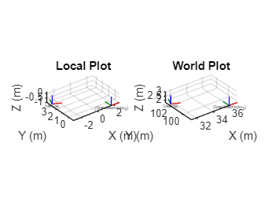
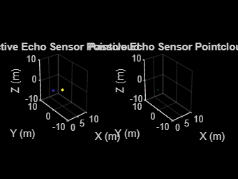
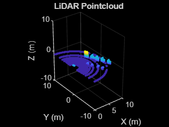
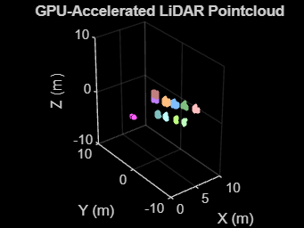
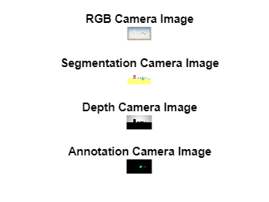
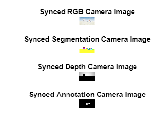

# How to use AirSim with Matlab

AirSim and Matlab can be integrated using Python. an example Matlab client is provided demonstrating how to interact with AirSim from Matlab.
This can be used from source or installed as a toolbox (install from [File Exchange](https://nl.mathworks.com/matlabcentral/fileexchange/168061-cosys-airsim-matlab-api-client), or from source by double-clicking or dragging into Matlab the file _Cosys-AirSim Matlab API Client.mltbx_)

## Prerequisites

These instructions are for Matlab 2024a (with toolboxes for the client: Computer Vision, Aerospace, Signal Processing Toolbox) UE 5.3 and latest AirSim release.
It also requires the AirSim python package to be installed. 
For this go into the _PythonClient_ folder and use pip to install it to your python environment that is also used in Matlab with `pip install .`
You can find out in Matlab what Python version is used with 
```matlab
pe = pyenv;
pe.Version
```

You should have these components installed and working before proceeding.

## Usage

This a client implementation of the RPC API for Matlab for the Cosys\-AirSim simulation framework. A main class AirSimClient is available which implements all API calls.
Do note that at this point not all functions have been tested and most function documentation was auto\-generated. This is still a WIP client.

### **Initial setup**

When starting with this wrapper, first try to make a connection to the Cosys\-AirSim simulation. 

```matlab
vehicle_name = "airsimvehicle";
airSimClient = AirSimClient(IsDrone=false, ApiControl=false, IP="127.0.0.1", port=41451, vehicleName=vehicle_name);
```

Now the client object can be used to run API methods from. All functions have some help text written for more information on them. 

### Example

This example will:

-  Connect to AirSim 
-  Get/set vehicle pose 
-  Get instance segmentation groundtruth table 
-  Get object pose(s) 
-  Get sensor data (imu, echo (active/passive), (gpu)LiDAR, camera (info, rgb, depth, segmentation, annotation)) 

Do note that the AirSim matlab client has almost all API functions available but not all are listed in this test script. For a full list see the source code fo the AirSimClient class. 


Do note the test script requires next to the toolboxes listed above in the Prerequisites the following Matlab toolboxes:

-  Lidar Toolbox 
-   Navigation Toolbox 
-  Robotics System Toolbox 
-  ROS Toolbox 
-  UAV Toolbox 
### Setup connection
```matlab

%Define client
vehicle_name = "airsimvehicle";
airSimClient = AirSimClient(IsDrone=false, ApiControl=false, IP="127.0.0.1", port=41451, vehicleName=vehicle_name);

```
### Groundtruth labels
```matlab
% Get groundtruth look-up-table of all objects and their instance
% segmentation colors for the cameras and GPU LiDAR
groundtruthLUT = airSimClient.getInstanceSegmentationLUT();

```
### Get some poses
```matlab
% All poses are right handed coordinate system X Y Z and
% orientations are defined as quaternions W X Y Z.

% Get poses of all objects in the scene, this takes a while for large
% scene so it is in comment by default
poses = airSimClient.getAllObjectPoses(false, false);

% Get vehicle pose
vehiclePoseLocal = airSimClient.getVehiclePose();
vehiclePoseWorld = airSimClient.getObjectPose(vehicle_name, false);

% Get an random object pose or choose if you know the name of one
useChosenObject = false;
chosenObject = "Cylinder3";

if useChosenObject
    finalName = chosenObject;
else
    randomIndex = randi(size(groundtruthLUT, 1), 1);
    randomName = groundtruthLUT.name(randomIndex);
    finalName = randomName;
end

objectPoseLocal = airSimClient.getObjectPose(finalName, true);
objectPoseWorld = airSimClient.getObjectPose(finalName, false);

figure;
subplot(1, 2, 1);
plotTransforms([vehiclePoseLocal.position; objectPoseLocal.position], [vehiclePoseLocal.orientation; objectPoseLocal.orientation], FrameLabel=["Vehicle"; finalName], AxisLabels="on")
axis equal;
grid on;
xlabel("X (m)")
ylabel("Y (m)")
zlabel("Z (m)")
title("Local Plot")

subplot(1, 2, 2);
plotTransforms([vehiclePoseWorld.position; objectPoseWorld.position], [vehiclePoseWorld.orientation; objectPoseWorld.orientation], FrameLabel=["Vehicle"; finalName], AxisLabels="on")

axis equal;
grid on;
xlabel("X (m)")
ylabel("Y (m)")
zlabel("Z (m)")
title("World Plot")
```



```matlab
drawnow

%% Set vehicle pose
airSimClient.setVehiclePose(airSimClient.getVehiclePose().position + [1 1 0], airSimClient.getVehiclePose().orientation)

```
### IMU sensor Data
```matlab

imuSensorName = "imu";
[imuData, imuTimestamp] = airSimClient.getIMUData(imuSensorName);

```
### Echo sensor data
```matlab
% Example plots passive echo pointcloud
% and its reflection directions as 3D quivers

echoSensorName = "echo";
enablePassive = true;
[activePointCloud, activeData, passivePointCloud, passiveData , echoTimestamp, echoSensorPose] = airSimClient.getEchoData(echoSensorName, enablePassive);

figure;
subplot(1, 2, 1);
if ~isempty(activePointCloud)
    pcshow(activePointCloud, color="X", MarkerSize=50);
else
    pcshow(pointCloud([0, 0, 0]));
end
title('Active Echo Sensor Pointcloud')
xlabel("X (m)")
ylabel("Y (m)")
zlabel("Z (m)")
xlim([0 10])
ylim([-10 10])
zlim([-10 10])

subplot(1, 2, 2);
if ~isempty(passivePointCloud)
    pcshow(passivePointCloud, color="X", MarkerSize=50);
    hold on;
    quiver3(passivePointCloud.Location(:, 1), passivePointCloud.Location(:, 2), passivePointCloud.Location(:, 3),...
        passivePointCloud.Normal(:, 1), passivePointCloud.Normal(:, 2), passivePointCloud.Normal(:, 3), 2);
    hold off
else
    pcshow(pointCloud([0, 0, 0]));
end
title('Passive Echo Sensor Pointcloud')
xlabel("X (m)")
ylabel("Y (m)")
zlabel("Z (m)")
xlim([0 10])
ylim([-10 10])
zlim([-10 10])
```



```matlab
drawnow

```
### LiDAR sensor data
```matlab
% Example plots lidar pointcloud and getting the groundtruth labels

lidarSensorName = "lidar";
enableLabels = true;
[lidarPointCloud, lidarLabels, LidarTimestamp, LidarSensorPose] = airSimClient.getLidarData(lidarSensorName, enableLabels);

figure;
if ~isempty(lidarPointCloud)
    pcshow(lidarPointCloud, MarkerSize=50);
else
    pcshow(pointCloud([0, 0, 0]));
end
title('LiDAR Pointcloud')
xlabel("X (m)")
ylabel("Y (m)")
zlabel("Z (m)")
xlim([0 10])
ylim([-10 10])
zlim([-10 10])
```



```matlab
drawnow

```
### GPU LiDAR sensor data
```matlab
% Example plots GPU lidar pointcloud with its RGB segmentation colors

gpuLidarSensorName = "gpulidar";
enableLabels = true;
[gpuLidarPointCloud, gpuLidarTimestamp, gpuLidarSensorPose] = airSimClient.getGPULidarData(gpuLidarSensorName);

figure;
if ~isempty(gpuLidarPointCloud)
    pcshow(gpuLidarPointCloud, MarkerSize=50);
else
    pcshow(pointCloud([0, 0, 0]));
end
title('GPU-Accelerated LiDAR Pointcloud')
xlabel("X (m)")
ylabel("Y (m)")
zlabel("Z (m)")
xlim([0 10])
ylim([-10 10])
zlim([-10 10])
```



```matlab
drawnow

```
### Cameras
```matlab

%% Get camera info
cameraSensorName = "frontcamera";
[intrinsics, cameraSensorPose] = airSimClient.getCameraInfo(cameraSensorName);

%% Get single camera images
% Get images sequentially 

cameraSensorName = "front_center";
[rgbImage, rgbCameraIimestamp] = airSimClient.getCameraImage(cameraSensorName, AirSimCameraTypes.Scene);
[segmentationImage, segmentationCameraIimestamp] = airSimClient.getCameraImage(cameraSensorName, AirSimCameraTypes.Segmentation);
[depthImage, depthCameraIimestamp] = airSimClient.getCameraImage(cameraSensorName, AirSimCameraTypes.DepthPlanar);
[annotationImage, annotationCameraIimestamp] = airSimClient.getCameraImage(cameraSensorName, AirSimCameraTypes.Annotation, "TextureTestDirect");
figure;
subplot(4, 1, 1);
imshow(rgbImage)
title("RGB Camera Image")
subplot(4, 1, 2);
imshow(segmentationImage)
title("Segmentation Camera Image")
subplot(4, 1, 3);
imshow(depthImage ./ max(max(depthImage)).* 255, gray)
title("Depth Camera Image")
subplot(4, 1, 4);
imshow(annotationImage)
title("Annotation Camera Image")
```



```matlab
%% Get synced camera images
% By combining the image requests they will be synced 
% and taken in the same frame

cameraSensorName = "front_center";
[images, cameraIimestamp] = airSimClient.getCameraImages(cameraSensorName, ...
                                                         [AirSimCameraTypes.Scene, AirSimCameraTypes.Segmentation, AirSimCameraTypes.DepthPlanar, AirSimCameraTypes.Annotation], ...
                                                         ["", "", "", "GreyscaleTest"]);
figure;
subplot(4, 1, 1);
imshow(images{1})
title("Synced RGB Camera Image")
subplot(4, 1, 2);
imshow(images{2})
title("Synced Segmentation Camera Image")
subplot(4, 1, 3);
imshow(images{3} ./ max(max(images{3})).* 255, gray)
title("Synced Depth Camera Image")
subplot(4, 1, 4);
imshow(images{4})
title("Synced Annotation Camera Image")
```



