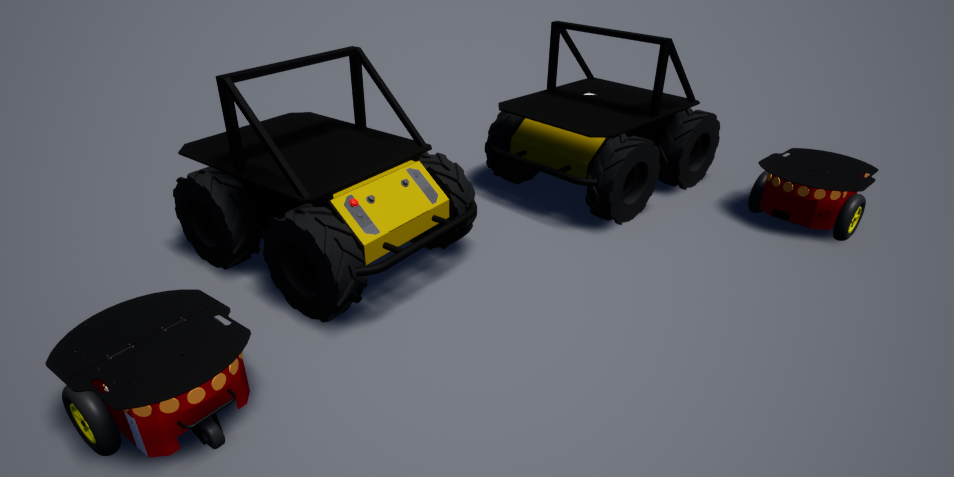

# Unreal Skid Steering Vehicle Model

For vehicles that can't use the normal WheeledVehicle setup with normal steering wheels and non-steering wheels, but that use the skid-steering/differential  steering (like a tank) an alternative vehicle model was created.
It is build using the Chaos engine of Unreal which does not support this vehicle type natively, as such, it can behave unrealistic at times.

http://www.robotplatform.com/knowledge/Classification_of_Robots/wheel_control_theory.html

## Creating a new skid steer vehicle
The steps to setup the vehicle are largely the same as a WheeledVehiclePawn with some slight adjustments.
1. Follow [this guide](https://dev.epicgames.com/documentation/en-us/unreal-engine/how-to-set-up-vehicles-in-unreal-engine?application_version=5.2) to create the skeletal mesh and physics asset.
2. For the wheels setup, the vehicle should have 4 wheels, 2 for the left side and 2 for the right side. Please use SkidWheel as the wheel class.
3. For the vehicle blueprint to create the pawn it is also largely the same as in that tutorial however as class one should use the *SkidVehiclePawn* sub-class. The vehicle setup parameters are more simplified. 
4. To have animated wheels, proper physics and correct steering behavior, please take a look at how the CPHusky is configured in the AirSim plugin. The Husky is a skid steer vehicle and can be used as a reference.

## Skid steer model within AirSim
The skid steer model is a separate SimMode within AirSim. It is fully implemented in similar fashion as the normal Car SimMode.
There are already two vehicle types implemented, the ClearPath Husky and Pioneer P3DX robots. To configure the SimMode and vehicle type see the [settings.json file documentation](settings.md).

If you create a new vehicle using the Unreal skid steering vehicle model as described above, one can use the `PawnPaths` setting in the [Common Vehicle Settings in the settings.json file](settings.md#common-vehicle-setting) to link the custom vehicle pawn.

Note that due to a bug in the ChaosVehicles and setting raw YawInput values when rotating on its axis to the left will cause a small forward movement as well. 
